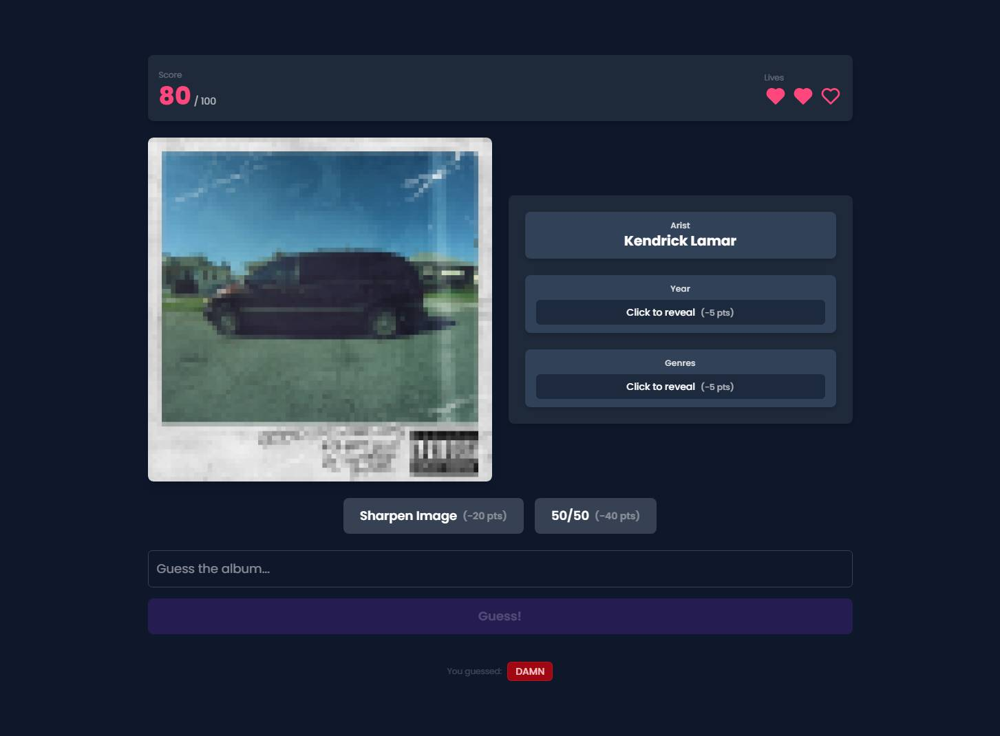

<div align="center">

  <h2 align="center">🎵 Name That Album 🎶</h2>

  <p align="center">
    <strong>Name That Album</strong> is a fun, music-themed guessing game where players identify albums based on their pixelated cover art. Think you know your music? Test your knowledge and see if you can guess them all! 🚀🎧
  </p>

  
</div>

## ⚙️ Built with
- Next.js
- TailwindCSS
- Prisma
- Zustand
- Fuse.js
- Framer Motion
- Love ❤️

## 🎮 How to play
The rules are simple: guess the album based on its pixelated cover art! Every game starts with a random album cover that’s obscured into a mosaic of pixels. Your mission? Uncover the mystery by identifying the album before your guesses (and lives!) run out.

You’ll start with 3 lives, and each incorrect guess costs one. Want a little help? You can spend some points to reveal clues like the artist’s name, the release year, or even a sharper version of the cover. But remember, every hint you take knocks down your score. Feeling lucky? Try the 50/50 hint to narrow it down to just two choices, but tread carefully—you only get one shot to pick the right answer!

Ready to test your musical knowledge? Jump in, have fun, and see how many albums you can name!

## 🛠️ Setup

### 1. Clone the Repository
```
git clone https://github.com/sarotnem/name-that-album.git
cd name-that-album
```

### 2. Install Dependencies
```
pnpm install
```

### 3. Configure Environment Variables
Copy the `.env.example` file, rename it to `.env' and adjust the values:
```
DATABASE_URL=postgresql://<username>:<password>@localhost:5432/<your-database-name>?schema=public
```

*For development you could also use a pglite database:*
```
DATABASE_URL="file:./dev.db"
```


### 4. Set Up the Database
```
pnpm prisma migrate dev --name init
```
This should migrate the database and seed the necessary data. If for any reason, seeding has failed you can run it with:
```
pnpm prisma db seed
```

### 5. Start the Development Server
```
pnpm run dev
```

## 💡 Credits
Album Data: <br>
[Rolling Stone Top 500 Albums (2023 Edition)](https://musicbrainz.org/series/bb3d9d84-75b8-4e67-8ad7-dcc38f764bf3)
<br>
Cover Art: <br>
[Cover Art Archive](https://coverartarchive.org/)

*Note: The data used in this project is taken "as-is" from MusicBrainz. If you notice any mistakes or inaccuracies, feel free to open an issue or submit a pull request.*